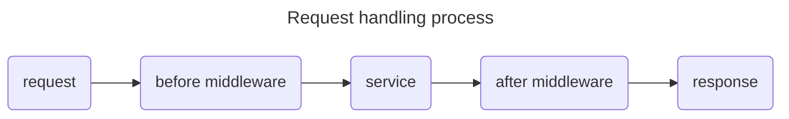

Middleware used in our project could be divided into two different types, `before middleware` and `after middleware`. The `before middleware` is executed before the request is handled by the service, while the `after middleware` is executed after the service has handled the request.



The `ghttp.MiddlewareHandlerResponse` registered before was an `after middleware`, which is used to standardize our response. And we would also add a `before middleware` to validate the JWT generated before.

## Response handler

Go to the definition of `ghttp.MiddlewareHandlerResponse`, you will find it content like this:

```go {linenos=table,linenostart=1}
func MiddlewareHandlerResponse(r *Request) {
	r.Middleware.Next()

	// There's custom buffer content, it then exits current handler.
	if r.Response.BufferLength() > 0 {
		return
	}

	var (
		msg  string
		err  = r.GetError()
		res  = r.GetHandlerResponse()
		code = gerror.Code(err)
	)
	if err != nil {
		if code == gcode.CodeNil {
			code = gcode.CodeInternalError
		}
		msg = err.Error()
	} else {
		if r.Response.Status > 0 && r.Response.Status != http.StatusOK {
			msg = http.StatusText(r.Response.Status)
			switch r.Response.Status {
			case http.StatusNotFound:
				code = gcode.CodeNotFound
			case http.StatusForbidden:
				code = gcode.CodeNotAuthorized
			default:
				code = gcode.CodeUnknown
			}
			// It creates error as it can be retrieved by other middlewares.
			err = gerror.NewCode(code, msg)
			r.SetError(err)
		} else {
			code = gcode.CodeOK
		}
	}

	r.Response.WriteJson(DefaultHandlerResponse{
		Code:    code.Code(),
		Message: msg,
		Data:    res,
	})
} 
```

At the second line of this function, we can see the `r.Middleware.Next()`. A typical `after middleware`
would form like this:
```go
func MiddlewareHandlerResponse(r *Request) {
	r.Middleware.Next()
    // some operations
}
```

We could see in this middleware, it finished some error handling functions and modified our response from line 39 to line 43. This is why our response is strange in the previous part.

To solve this problem, we could create our own middleware __`service`__.

### Create middleware logic

The `GoFrame` provided a command line tool to generate service interface with using `gf gen service`. And to generate a service, first we need to create its implementation in logic folder. Create a folder `middleware` in `internal/logic`. Then create a `middleware.go` file:

```go {filename="internal/logic/middleware/middleware.go"}
package middleware

import (
	"github.com/gogf/gf/v2/net/ghttp"
)

type sMiddleware struct{}

func New() *sMiddleware {
	return &sMiddleware{}
}
func (s *sMiddleware) ResponseHandler(r *ghttp.Request) {
	// ToDo
}
```

### Generate service

Now we could use `gf gen service` to generate the service interface:

```
$ gf gen service
generating service go file: internal/service\middleware.go
generating init go file: internal/logic\logic.go
gofmt go files in "internal/service"
update main.go
done!
```

You will see the `internal/service/middleware.go` file generated by `GoFrame`.


To avoid run this command every time after changing some code in `logic` directory, you could also use some auto-run plugin, like `Run on Save` in VSCode.


### Add middleware logic

{}
You could also change the `New` function to:

```go {filename="internal/logic/middleware/middleware.go"}
func New() service.IMiddleware {
	return &sMiddleware{}
}
```

This is not strictly required, just for standardization. You could also keep it as before.
{}

Go back to the logic file we created before, first we need to register the implementation of the interface. Add this to your file:

```go {filename="internal/logic/middleware/middleware.go"}
func init() {
	service.RegisterMiddleware(New())
}
```

Then we could add some logic in the function:

```go {filename="internal/logic/middleware/middleware.go"}
func (s *sMiddleware) ResponseHandler(r *ghttp.Request) {
	r.Middleware.Next()

	if r.Response.BufferLength() > 0 {
		return
	}
	res := r.GetHandlerResponse()
	r.Response.WriteJson(res)
}
```

You could also mimic the original middleware to create your own response handler logic. But to be simple, we just return our response directly here. 

### Register middleware

To use our middleware, we still need to bind it to our route. Open and change the middleware in route registration file `internal/cmd/cmd.go`:

```go {filename="internal/cmd/cmd.go",hl_lines=[2]}
s.Group("/message", func(group *ghttp.RouterGroup) {
	group.Middleware(service.Middleware().ResponseHandler)
	group.Bind(
		message.NewV1(),
	)
})
```

Now you can have the same test we made before:



POST `http://localhost:8000/message`

```json
{
  "user_uid": "0000000000",
  "content": "This is my first message."
}
```


```bash
curl -X POST -H "Content-Type: application/json" -d '{"user_uid":"0000000000","content":"This is my first message."}' "http://localhost:8000/message"
```



You will see the response is in the correct format:

```json
{
	"code": 0,
	"message": "Success",
	"data": null
}
```

## JWT Authentication

Similarly, we could add a function in `middleware` logic. Use the function provided by `jwt_auth` service we created before.

```go {filename="internal/logic/middleware/middleware.go"}
func (s *sMiddleware) Auth(r *ghttp.Request) {
	service.JWTAuth().MiddlewareFunc()(r)
	r.Middleware.Next()
}
```

Since it is a `before middleware`, we need to add `r.Middleware.Next()` at the end of the function.


Remember to run `gf gen service` after you add the function.


Then we could bind this middleware to our route:

```go {filename="internal/cmd/cmd.go",hl_lines=[4]}
s.Group("/message", func(group *ghttp.RouterGroup) {
	group.Middleware(
		service.Middleware().ResponseHandler,
		service.Middleware().Auth,
	)
	group.Bind(
		message.NewV1(),
	)
})
```

Now try the request before, you will get the following response:

```json
{
    "code": 401,
    "message": "query token is empty"
}
```

This response was generated by the authentication middleware automatically, meaning your request was blocked by the middleware. We need to add token we get before when sending the request now.


Use [http://localhost:8000/hello](http://localhost:8000/hello) to get your token again.




POST `http://localhost:8000/message`

- Use `Authorization` with `Bearer` and `<your token>`
- Or add `?token=<your token>` query in the url

```json
{
  "user_uid": "0000000000",
  "content": "This is my first message."
}
```


```bash
curl -X POST -H "Content-Type: application/json" -d '{"user_uid":"0000000000","content":"This is my first message."}' "http://localhost:8000/message?token=<your token>"
```



And you will see the success response.
