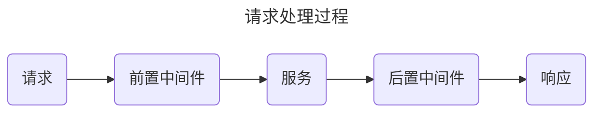

在我们的项目中使用的中间件可以大体上分为两类，分别是 `前置中间件` 和 `后置中间件`。`前置中间件` 在请求被服务处理之前执行，而 `后置中间件` 则在服务处理完请求之后执行。



之前注册的 `ghttp.MiddlewareHandlerResponse` 是一个用于标准化响应的 `后置中间件`。而我们也将添加一个用于验证之前生成的 JWT 的 `前置中间件`。

## 响应处理

找到 `ghttp.MiddlewareHandlerResponse` 的定义，你会发现它的内容如下：

```go {linenos=table,linenostart=1}
func MiddlewareHandlerResponse(r *Request) {
	r.Middleware.Next()

	// There's custom buffer content, it then exits current handler.
	if r.Response.BufferLength() > 0 {
		return
	}

	var (
		msg  string
		err  = r.GetError()
		res  = r.GetHandlerResponse()
		code = gerror.Code(err)
	)
	if err != nil {
		if code == gcode.CodeNil {
			code = gcode.CodeInternalError
		}
		msg = err.Error()
	} else {
		if r.Response.Status > 0 && r.Response.Status != http.StatusOK {
			msg = http.StatusText(r.Response.Status)
			switch r.Response.Status {
			case http.StatusNotFound:
				code = gcode.CodeNotFound
			case http.StatusForbidden:
				code = gcode.CodeNotAuthorized
			default:
				code = gcode.CodeUnknown
			}
			// It creates error as it can be retrieved by other middlewares.
			err = gerror.NewCode(code, msg)
			r.SetError(err)
		} else {
			code = gcode.CodeOK
		}
	}

	r.Response.WriteJson(DefaultHandlerResponse{
		Code:    code.Code(),
		Message: msg,
		Data:    res,
	})
} 
```

在第二行有一个 `r.Middleware.Next()`。一个标准的 `后置中间件` 形式如下：
```go
func MiddlewareHandlerResponse(r *Request) {
	r.Middleware.Next()
    // some operations
}
```

这个中间件完成了一些错误处理，并在第39到43行修改了我们的最终响应。这就是之前响应格式奇怪的原因。

为了解决这一问题，我们需要创建另一个 **`中间件`**。

### 创建中间件 logic

`GoFrame` 提供了一个命令行工具 `gf gen service` 来生成服务接口。不过在使用之前，我们需要在 logic 目录下创建它的具体实现。在 `internal/logic` 目录下创建一个 `middleware` 文件夹，然后创建 `middleware.go` 文件：

```go {filename="internal/logic/middleware/middleware.go"}
package middleware

import (
	"github.com/gogf/gf/v2/net/ghttp"
)

type sMiddleware struct{}

func New() *sMiddleware {
	return &sMiddleware{}
}
func (s *sMiddleware) ResponseHandler(r *ghttp.Request) {
	// ToDo
}
```

### 生成 service

现在我们可以使用 `gf gen service` 命令来生成服务接口了：

```
$ gf gen service
generating service go file: internal/service\middleware.go
generating init go file: internal/logic\logic.go
gofmt go files in "internal/service"
update main.go
done!
```
可以看到 `GoFrame` 为我们生成了 `internal/service/middleware.go` 文件。


为了避免每次更改完 `logic` 目录下的代码后都要手动运行这个命令，你可以使用一些自动运行插件，例如 VSCode 中的 `Run on Save`。


### 完善中间件逻辑

{}
你也可以将 `New` 函数改为：

```go {filename="internal/logic/middleware/middleware.go"}
func New() service.IMiddleware {
	return &sMiddleware{}
}
```

这里仅仅是为了标准化返回类型，并不是强制需求，你也可以不更改。
{}

回到之前在 logic 中创建的文件，首先我们需要注册接口的实现。在你的文件中添加如下代码：

```go {filename="internal/logic/middleware/middleware.go"}
func init() {
	service.RegisterMiddleware(New())
}
```

然后我们可以添加一些处理逻辑：

```go {filename="internal/logic/middleware/middleware.go"}
func (s *sMiddleware) ResponseHandler(r *ghttp.Request) {
	r.Middleware.Next()

	if r.Response.BufferLength() > 0 {
		return
	}
	res := r.GetHandlerResponse()
	r.Response.WriteJson(res)
}
```

你也可以模仿原来的中间件来完成自己的响应处理逻辑。但为保简洁，在这里我们直接返回响应。

### 绑定中间件

要使用中间件，我们还需要将它绑定到对应的路由。更改路由注册文件 `internal/cmd/cmd.go` 中的中间件：

```go {filename="internal/cmd/cmd.go",hl_lines=[2]}
s.Group("/messages", func(group *ghttp.RouterGroup) {
	group.Middleware(service.Middleware().ResponseHandler)
	group.Bind(
		message.NewV1(),
	)
})
```

现在你可以进行和之前相同的测试：



POST `http://localhost:8000/messages`

```json
{
  "user_uid": "0000000000",
  "content": "This is my first message."
}
```


```bash
curl -X POST -H "Content-Type: application/json" -d '{"user_uid":"0000000000","content":"This is my first message."}' "http://localhost:8000/messages"
```



你会看到响应格式现在是正确的了：

```json
{
	"code": 0,
	"message": "Success",
	"data": null
}
```

## JWT 认证

同样，我们也可以在 `middleware` 中添加 JWT 认证。使用创建的 `jwt_auth` 服务中提供的函数。

```go {filename="internal/logic/middleware/middleware.go"}
func (s *sMiddleware) Auth(r *ghttp.Request) {
	service.JWTAuth().MiddlewareFunc()(r)
	r.Middleware.Next()
}
```

由于这是一个 `前置中间件`，我们需要在函数末尾添加 `r.Middleware.Next()`。


添加完函数后记得运行 `gf gen service`。


然后我们可以将中间件绑定到路由：

```go {filename="internal/cmd/cmd.go",hl_lines=[4]}
s.Group("/messages", func(group *ghttp.RouterGroup) {
	group.Middleware(
		service.Middleware().ResponseHandler,
		service.Middleware().Auth,
	)
	group.Bind(
		message.NewV1(),
	)
})
```

再尝试一遍之前的请求，我们将得到如下响应：

```json
{
    "code": 401,
    "message": "query token is empty"
}
```

这是鉴权中间件自动生成的响应，看到它意味着你的请求被中间件拦截了。现在我们需要在请求中添加之前获得的 token。


打开 [http://localhost:8000/hello](http://localhost:8000/hello) 再次获取 token。




POST `http://localhost:8000/messages`

- 使用 `Bearer` 的 `Authorization` 并填入 `<your token>`
- 在 url 中添加查询参数 `?token=<your token>`

```json
{
  "user_uid": "0000000000",
  "content": "This is my first message."
}
```


```bash
curl -X POST -H "Content-Type: application/json" -d '{"user_uid":"0000000000","content":"This is my first message."}' "http://localhost:8000/messages?token=<your token>"
```



你将看到成功的响应。
